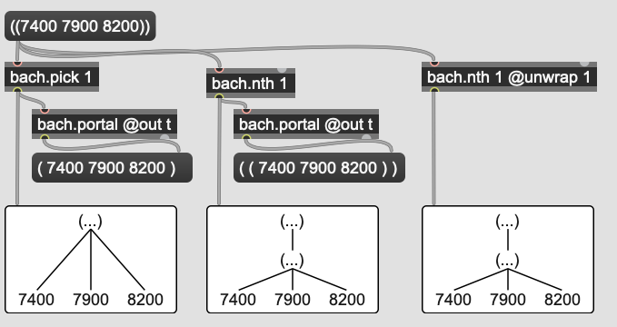

# `bach.nth`와 `bach.pick` 비교

### 공통점

`bach.nth`와 `bach.pick`은 어떤 lll 중의 elements를 출력하는 데 사용한다. 각 오브젝트의 argument에 출력하고 싶은 lll의 address를 설정하면 된다.

### 차이점

bach.nth는 element의 level 변화 없이 그대로 출력되는 반면, bach.pick은 해당 element의 elements("요소들")가 출력된다. 아래 그림을 참고하면 차이를 쉽게 판단할 수 있다. bach.nth에 @unwrap 1 attribute를 사용하면 bach.nth와 같은 결과를 얻을 수 있다.

패처파일:   [2019-11-09-nth_pick.maxpat](../resources/2019-11-09-nth_pick/max/2019-11-09-nth_pick.maxpat) 